# Design Document

## Overview

This design document outlines the comprehensive architecture for creating the Digital India Startup theme steering file that will serve as the definitive visual design system for BuilderBase. The steering file will provide pixel-perfect implementation guidance, detailed component specifications, animation guidelines, and responsive design patterns that embody the Digital India initiative while maintaining modern startup aesthetics.

The design integrates Deep Blue (#1565C0) and Digital India Orange (#FF6B35) as primary colors, creating a professional yet culturally relevant design system that addresses all requirements from the ui-mockup-enhancement spec.

## Architecture

### Steering File Structure

```mermaid
graph TB
    subgraph "Digital India Theme Steering File"
        A[Theme Overview & Philosophy]
        B[Color System & Palette]
        C[Typography & Font System]
        D[Component Library Specifications]
        E[Page Layout Designs]
        F[Animation & Interaction Guidelines]
        G[Responsive Design Patterns]
        H[Indian Context Integration]
        I[Material-UI Theme Configuration]
        J[Implementation Guidelines]
    end
    
    subgraph "Component Specifications"
        K[Button Variants & States]
        L[Form Components & Validation]
        M[Navigation & Header/Footer]
        N[Cards & Data Display]
        O[Loading & Empty States]
    end
    
    subgraph "Page-Specific Designs"
        P[Landing Page Layout]
        Q[Dashboard Design]
        R[Learning Paths Interface]
        S[Government Schemes Pages]
        T[Community Forum Layout]
        U[Profile & Settings Pages]
    end
    
    subgraph "Animation System"
        V[Page Transitions]
        W[Component Animations]
        X[Micro-interactions]
        Y[Progress Animations]
        Z[Scroll Effects]
    end
    
    A --> B
    A --> C
    B --> D
    C --> D
    D --> K
    D --> L
    D --> M
    D --> N
    D --> O
    E --> P
    E --> Q
    E --> R
    E --> S
    E --> T
    E --> U
    F --> V
    F --> W
    F --> X
    F --> Y
    F --> Z
```



### Design System Architecture

The steering file will be organized into ten comprehensive sections, each providing detailed specifications for different aspects of the Digital India Startup theme:

1. **Theme Foundation**: Core design philosophy, color psychology, and cultural context
2. **Visual Identity**: Logo usage, brand elements, and Digital India integration
3. **Component Specifications**: Detailed Material-UI component customizations
4. **Layout Systems**: Grid systems, spacing, and responsive patterns
5. **Animation Framework**: Timing, easing, and performance guidelines
6. **Page Templates**: Complete page designs with ASCII mockups
7. **Interactive States**: User feedback and state management
8. **Accessibility Standards**: WCAG compliance and inclusive design
9. **Performance Guidelines**: Optimization and loading strategies
10. **Implementation Code**: Material-UI theme configuration and examples

## Components and Interfaces

### Core Design System Components

#### 1. Color System Architecture
```typescript
interface DigitalIndiaColorSystem {
  primary: {
    main: '#1565C0';        // Deep Blue - Trust & Professionalism
    light: '#5E92F3';       // Lighter blue for hover states
    dark: '#003C8F';        // Darker blue for active states
    contrastText: '#FFFFFF'; // White text on blue backgrounds
  };
  secondary: {
    main: '#FF6B35';        // Digital India Orange - Energy & Innovation
    light: '#FF9A66';       // Lighter orange for hover states
    dark: '#C73E02';        // Darker orange for active states
    contrastText: '#FFFFFF'; // White text on orange backgrounds
  };
  accent: {
    teal: '#00695C';        // Growth & Stability
    saffron: '#FF9933';     // Indian Identity & Energy
    success: '#388E3C';     // Success states
    warning: '#F57C00';     // Warning states
    error: '#D32F2F';       // Error states
  };
  background: {
    default: '#FAFAFA';     // Light grey background
    paper: '#FFFFFF';       // White surface
    digital: '#F8FAFF';     // Subtle blue tint for digital sections
  };
  text: {
    primary: '#212121';     // Dark grey for primary text
    secondary: '#757575';   // Medium grey for secondary text
    disabled: '#BDBDBD';    // Light grey for disabled text
  };
}
```

#### 2. Typography System Architecture
```typescript
interface DigitalIndiaTypography {
  fontFamily: {
    primary: '"Inter", "Roboto", "Helvetica", "Arial", sans-serif';
    secondary: '"Poppins", "Inter", sans-serif';
    hindi: '"Noto Sans Devanagari", "Inter", sans-serif';
    monospace: '"Fira Code", "Monaco", "Consolas", monospace';
  };
  scale: {
    h1: { fontSize: '3rem', fontWeight: 700, lineHeight: 1.2 };      // 48px - Page Titles
    h2: { fontSize: '2.25rem', fontWeight: 700, lineHeight: 1.3 };   // 36px - Section Headers
    h3: { fontSize: '1.5rem', fontWeight: 500, lineHeight: 1.4 };    // 24px - Card Titles
    h4: { fontSize: '1.25rem', fontWeight: 500, lineHeight: 1.4 };   // 20px - Subsection Headers
    h5: { fontSize: '1.125rem', fontWeight: 500, lineHeight: 1.5 };  // 18px - Component Headers
    h6: { fontSize: '1rem', fontWeight: 500, lineHeight: 1.5 };      // 16px - Small Headers
    body1: { fontSize: '1rem', fontWeight: 400, lineHeight: 1.6 };   // 16px - Primary Body
    body2: { fontSize: '0.875rem', fontWeight: 400, lineHeight: 1.6 }; // 14px - Secondary Body
    caption: { fontSize: '0.75rem', fontWeight: 400, lineHeight: 1.4 }; // 12px - Captions
  };
  responsive: {
    mobile: { h1: '2.5rem', h2: '2rem', h3: '1.25rem' };
    tablet: { h1: '2.75rem', h2: '2.125rem', h3: '1.375rem' };
    desktop: { h1: '3rem', h2: '2.25rem', h3: '1.5rem' };
  };
}
```

#### 3. Component State System
```typescript
interface ComponentStates {
  button: {
    default: { elevation: 0, transform: 'none' };
    hover: { elevation: 2, transform: 'translateY(-1px)' };
    active: { elevation: 1, transform: 'translateY(0px)' };
    disabled: { opacity: 0.6, cursor: 'not-allowed' };
    loading: { opacity: 0.8, cursor: 'wait' };
  };
  card: {
    default: { elevation: 1, transform: 'none' };
    hover: { elevation: 4, transform: 'translateY(-2px)' };
    active: { elevation: 2, transform: 'translateY(-1px)' };
    selected: { borderColor: 'primary.main', elevation: 3 };
  };
  input: {
    default: { borderColor: 'grey.300' };
    focus: { borderColor: 'primary.main', boxShadow: '0 0 0 2px rgba(21, 101, 192, 0.2)' };
    error: { borderColor: 'error.main', boxShadow: '0 0 0 2px rgba(211, 47, 47, 0.2)' };
    success: { borderColor: 'success.main', boxShadow: '0 0 0 2px rgba(56, 142, 60, 0.2)' };
    disabled: { backgroundColor: 'grey.100', cursor: 'not-allowed' };
  };
}
```

### Page Layout Specifications

#### 1. Landing Page Architecture
```
Digital India Landing Page Layout:
┌─────────────────────────────────────────────────────────────────────────────────┐
│ HEADER (White bg, 64px height, sticky)                                         │
│ ┌─────────────────────────────────────────────────────────────────────────────┐ │
│ │ [🧭 Logo] [Nav: Learning|Resources|Community|Schemes] [Login][Sign Up]      │ │
│ └─────────────────────────────────────────────────────────────────────────────┘ │
│ ████████████████████████████████████████████████████████████████████████████████ │ ← Digital India Orange accent (4px)
├─────────────────────────────────────────────────────────────────────────────────┤
│ HERO SECTION (min-height: 600px, digital grid background)                      │
│ ┌─────────────────────────────────────────────────────────────────────────────┐ │
│ │ LEFT (60%, padding: 80px 40px)     │ RIGHT (40%, padding: 80px 40px)        │ │
│ │                                    │                                         │ │
│ │ India's Complete                   │ ┌─────────────────────────────────────┐ │ │
│ │ 🟠 Digital Startup Playbook       │ │ Quick Start Checklist              │ │ │
│ │ (H1, Deep Blue, 48px, bold)       │ │ (Card, elevation: 3, blue bg)      │ │ │
│ │                                    │ │                                     │ │ │
│ │ Navigate Indian regulations,       │ │ ✓ Company Registration Guide       │ │ │
│ │ access government schemes, and     │ │ ✓ GST & Tax Setup                  │ │ │
│ │ build your startup with AI-powered │ │ ✓ Government Scheme Access         │ │ │
│ │ guidance. (Body1, 18px, grey.700)  │ │ ✓ Digital India Integration        │ │ │
│ │                                    │ │                                     │ │ │
│ │ [🚀 Start Your Journey]            │ │ [📱 Download Mobile App]           │ │ │
│ │ (Primary button, orange bg)        │ │ (Secondary button, outlined)        │ │ │
│ │ [▶ Watch Demo]                     │ │                                     │ │ │
│ │ (Text button, blue color)          │ │                                     │ │ │
│ │                                    │ │                                     │ │ │
│ │ ✅ Free to start • No credit card  │ │                                     │ │ │
│ │ (Caption, success color)           │ │                                     │ │ │
│ └─────────────────────────────────────────────────────────────────────────────┘ │
├─────────────────────────────────────────────────────────────────────────────────┤
│ FEATURES SECTION (padding: 120px 0, background: #F8FAFF)                       │
│ ┌─────────────────────────────────────────────────────────────────────────────┐ │
│ │ Digital India Startup Ecosystem (H2, center, 36px, Deep Blue)              │ │
│ │ Powered by AI, Built for Indian Entrepreneurs (Body1, center, grey.600)    │ │
│ │                                                                             │ │
│ │ ┌─────────────┐ ┌─────────────┐ ┌─────────────┐ ┌─────────────┐           │ │
│ │ │ 🤖 AI Guide │ │ 🏛️ Schemes  │ │ 📱 Mobile   │ │ 🌐 Community│           │ │
│ │ │ (Card hover │ │ Locator     │ │ First       │ │ Network     │           │ │
│ │ │ animation)  │ │             │ │             │ │             │           │ │
│ │ │             │ │ Find govt   │ │ Access on   │ │ Connect with│           │ │
│ │ │ AI-powered  │ │ schemes &   │ │ any device  │ │ 50,000+     │           │ │
│ │ │ guidance    │ │ grants with │ │ with offline│ │ founders    │           │ │
│ │ │ tailored    │ │ real-time   │ │ support     │ │ across India│           │ │
│ │ │ for India   │ │ updates     │ │             │ │             │           │ │
│ │ └─────────────┘ └─────────────┘ └─────────────┘ └─────────────┘           │ │
│ └─────────────────────────────────────────────────────────────────────────────┘ │
└─────────────────────────────────────────────────────────────────────────────────┘
```

#### 2. Dashboard Layout Architecture
```
Digital India Dashboard Layout:
┌─────────────────────────────────────────────────────────────────────────────────┐
│ HEADER (64px, white bg, shadow: 0 2px 4px rgba(0,0,0,0.1))                     │
│ [🧭 Logo] [Search Bar] [Notifications 🔔] [Profile Avatar ▼]                    │
├─────────────────────────────────────────────────────────────────────────────────┤
│ SIDEBAR (280px, fixed)          │ MAIN CONTENT (calc(100% - 280px))            │
│ ┌─────────────────────────────┐ │                                               │
│ │ Digital India Dashboard     │ │ ┌───────────────────────────────────────────┐ │
│ │ (H3, Deep Blue, 24px)       │ │ │ Welcome back, Priya! 👋                   │ │
│ │                             │ │ │ (Card, gradient bg: blue to orange)      │ │
│ │ 🏠 Dashboard           ●    │ │ │                                           │ │
│ │ 📚 Learning Paths      ③    │ │ │ You're 60% through startup registration   │ │
│ │ 🏛️ Government Schemes       │ │ │ ████████████████░░░░░░░░░░ 60%            │ │
│ │ 📁 Resource Library         │ │ │ (Progress bar, animated fill)             │ │
│ │ 💬 Community Forum     ⑤    │ │ └───────────────────────────────────────────┘ │
│ │ 🎯 Expert Directory         │ │                                               │
│ │ 👤 Profile & Settings       │ │ STATS GRID (4 columns, gap: 24px)            │
│ │                             │ │ ┌─────────┐ ┌─────────┐ ┌─────────┐ ┌─────┐ │
│ │ ─────────────────────────   │ │ │ ✅  5   │ │ ⏳  3   │ │ 💰₹2.5L │ │📊85%│ │
│ │ 🔧 Settings                 │ │ │Completed│ │Pending  │ │Available│ │Done │ │
│ │ 🚪 Logout                   │ │ │Tasks    │ │Actions  │ │Grants   │ │     │ │
│ └─────────────────────────────┘ │ │(Success)│ │(Warning)│ │(Primary)│ │(Teal│ │
│                                 │ └─────────┘ └─────────┘ └─────────┘ └─────┘ │
│                                 │                                               │
│                                 │ ACTIVITY FEED (2 columns)                    │
│                                 │ ┌─────────────────────┐ ┌─────────────────┐ │
│                                 │ │ 📋 To-Do List       │ │ 🎯 Recommended  │ │
│                                 │ │ (Card, white bg)    │ │ (Card, blue bg) │ │
│                                 │ │                     │ │                 │ │
│                                 │ │ ☐ Complete GST reg  │ │ • Maharashtra   │ │
│                                 │ │ ☐ Upload PAN docs   │ │   Startup Policy│ │
│                                 │ │ ✅ Choose name      │ │ • MSME Guide    │ │
│                                 │ │ ✅ Reserve domain   │ │ • VC Pitch Deck │ │
│                                 │ └─────────────────────┘ └─────────────────┘ │
└─────────────────────────────────────────────────────────────────────────────────┘
```

### Animation and Interaction Framework

#### 1. Animation Timing System
```typescript
interface AnimationTimings {
  // Micro-interactions (0-300ms)
  micro: {
    buttonHover: '150ms ease-out';
    ripple: '200ms ease-out';
    tooltip: '100ms ease-in-out';
    focus: '150ms ease-out';
  };
  
  // Component animations (300-500ms)
  component: {
    cardHover: '300ms cubic-bezier(0.4, 0, 0.2, 1)';
    modalOpen: '400ms cubic-bezier(0.25, 0.46, 0.45, 0.94)';
    drawerSlide: '350ms cubic-bezier(0.4, 0, 0.6, 1)';
    accordionExpand: '300ms ease-in-out';
  };
  
  // Page transitions (500-800ms)
  page: {
    routeChange: '600ms cubic-bezier(0.4, 0, 0.2, 1)';
    fadeIn: '500ms ease-out';
    slideUp: '700ms cubic-bezier(0.25, 0.46, 0.45, 0.94)';
  };
  
  // Loading states (1000ms+)
  loading: {
    skeleton: '1200ms ease-in-out infinite';
    progressBar: '2000ms linear';
    spinner: '1000ms linear infinite';
  };
}
```

#### 2. Scroll Animation Framework
```typescript
interface ScrollAnimations {
  fadeInUp: {
    initial: { opacity: 0, y: 60 };
    animate: { opacity: 1, y: 0 };
    transition: { duration: 0.6, ease: 'easeOut' };
  };
  
  staggerChildren: {
    animate: { transition: { staggerChildren: 0.1 } };
  };
  
  parallax: {
    backgroundSpeed: 0.5;
    elementSpeed: 0.8;
    threshold: 0.1;
  };
  
  progressBar: {
    trackProgress: true;
    smoothScroll: true;
    offset: 64; // Header height
  };
}
```

## Data Models

### Theme Configuration Data Model

#### 1. Material-UI Theme Structure
```typescript
interface DigitalIndiaTheme extends Theme {
  palette: DigitalIndiaColorSystem;
  typography: DigitalIndiaTypography;
  spacing: (factor: number) => string; // 8px base unit
  breakpoints: {
    values: {
      xs: 0;
      sm: 600;
      md: 960;
      lg: 1280;
      xl: 1920;
    };
  };
  components: {
    MuiButton: ComponentOverride;
    MuiCard: ComponentOverride;
    MuiTextField: ComponentOverride;
    MuiAppBar: ComponentOverride;
    // ... other component overrides
  };
  custom: {
    animations: AnimationTimings;
    digitalIndia: {
      patterns: DigitalPatterns;
      gradients: GradientDefinitions;
      shadows: CustomShadows;
    };
  };
}
```

#### 2. Component Override Structure
```typescript
interface ComponentOverride {
  styleOverrides: {
    root: CSSProperties | ((props: any) => CSSProperties);
    [key: string]: CSSProperties | ((props: any) => CSSProperties);
  };
  variants?: Array<{
    props: Record<string, any>;
    style: CSSProperties;
  }>;
  defaultProps?: Record<string, any>;
}
```

### Page Template Data Models

#### 1. Page Layout Configuration
```typescript
interface PageLayout {
  id: string;
  name: string;
  description: string;
  sections: PageSection[];
  responsive: ResponsiveConfig;
  animations: AnimationConfig;
  seo: SEOConfig;
}

interface PageSection {
  id: string;
  type: 'hero' | 'features' | 'content' | 'cta' | 'footer';
  layout: 'full-width' | 'container' | 'sidebar';
  background: BackgroundConfig;
  spacing: SpacingConfig;
  components: ComponentConfig[];
}
```

#### 2. Component Configuration
```typescript
interface ComponentConfig {
  type: string;
  props: Record<string, any>;
  styling: {
    className?: string;
    sx?: SxProps;
    variants?: string[];
  };
  responsive: {
    mobile?: Partial<ComponentConfig>;
    tablet?: Partial<ComponentConfig>;
    desktop?: Partial<ComponentConfig>;
  };
  animations?: AnimationConfig;
}
```

## Error Handling

### Design System Error Management

#### 1. Component State Errors
- **Invalid Props**: Fallback to default styling with console warnings
- **Theme Access Errors**: Graceful degradation to Material-UI defaults
- **Animation Failures**: Disable animations and use static states
- **Responsive Breakpoint Issues**: Default to mobile-first approach

#### 2. Asset Loading Errors
- **Font Loading Failures**: Fallback font stack with system fonts
- **Icon Loading Issues**: Text-based fallbacks or placeholder icons
- **Image Loading Problems**: Placeholder images with retry mechanisms
- **CSS Loading Errors**: Inline critical styles as fallback

#### 3. Performance Error Handling
- **Animation Performance**: Automatic reduction for low-end devices
- **Memory Constraints**: Lazy loading and component cleanup
- **Network Issues**: Offline-first approach with cached assets
- **Browser Compatibility**: Progressive enhancement with feature detection

## Testing Strategy

### Design System Testing Approach

#### 1. Visual Regression Testing
- **Component Screenshots**: Automated visual testing for all component states
- **Page Layout Testing**: Full-page screenshots across different breakpoints
- **Animation Testing**: Frame-by-frame animation verification
- **Cross-browser Testing**: Visual consistency across Chrome, Firefox, Safari, Edge

#### 2. Accessibility Testing
- **Color Contrast**: Automated testing for WCAG AA compliance
- **Keyboard Navigation**: Tab order and focus management testing
- **Screen Reader**: ARIA label and semantic HTML validation
- **Touch Target Size**: Minimum 44px touch target verification

#### 3. Performance Testing
- **Animation Performance**: 60fps animation verification
- **Bundle Size**: Theme and component bundle size monitoring
- **Loading Times**: Critical CSS and font loading optimization
- **Memory Usage**: Component cleanup and memory leak detection

#### 4. Responsive Design Testing
- **Breakpoint Testing**: Layout verification at all breakpoints
- **Device Testing**: Real device testing on iOS and Android
- **Orientation Testing**: Portrait and landscape layout validation
- **Touch Interaction**: Gesture and touch event testing

### Implementation Validation

#### 1. Code Quality Assurance
- **TypeScript Compliance**: Strict type checking for theme configuration
- **ESLint Rules**: Custom rules for design system consistency
- **Prettier Configuration**: Consistent code formatting
- **Storybook Integration**: Component documentation and testing

#### 2. Design Token Validation
- **Color Accessibility**: Automated contrast ratio checking
- **Typography Scale**: Mathematical scale validation
- **Spacing Consistency**: 8px grid system compliance
- **Component Variants**: Comprehensive variant coverage testing

This comprehensive design document provides the foundation for creating a detailed Digital India Startup theme steering file that addresses all UI mockup enhancement requirements while maintaining high standards for accessibility, performance, and user experience.