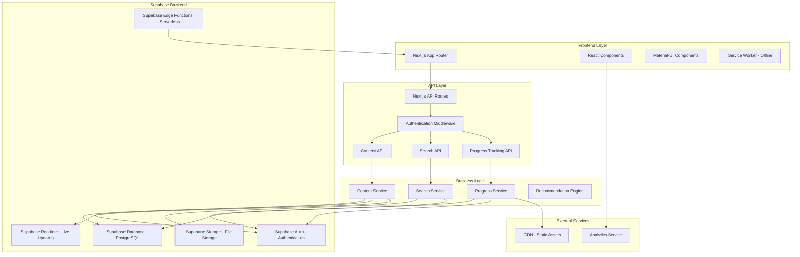

# Design Document

## Overview

The Knowledge Core module is designed as a comprehensive content management and delivery system that serves as the educational backbone of BuilderBase. The system architecture emphasizes scalability, search performance, and user experience optimization for the Indian market context.

The design follows a modern full-stack approach with Next.js frontend and Supabase as the backend-as-a-service platform. Supabase provides PostgreSQL database, real-time subscriptions, authentication, storage, and Edge Functions. The system supports both static and dynamic content delivery with robust search capabilities and offline functionality.

## Architecture

### High-Level Architecture



### System Components

#### Frontend Architecture
- **Next.js 13+ App Router**: Server-side rendering for SEO optimization
- **Material-UI (MUI)**: Consistent design system with Indian color palette
- **React Query**: Data fetching, caching, and synchronization
- **Service Worker**: Offline content caching and progressive web app features
- **Framer Motion**: Smooth animations for learning path progression

#### Backend Services (Supabase)
- **Supabase Database**: PostgreSQL database for structured content, user data, and relationships
- **Supabase Auth**: User authentication and authorization with Row Level Security
- **Supabase Storage**: File storage for images, videos, and downloadable content
- **Supabase Edge Functions**: Serverless functions for complex business logic and integrations
- **Supabase Realtime**: Real-time subscriptions for live progress updates and notifications

#### Data Storage Strategy
- **Supabase PostgreSQL**: Primary database with full-text search capabilities and JSON support
- **Supabase Storage**: Media assets and downloadable templates with CDN delivery
- **Local Storage**: Client-side caching for offline functionality and performance
- **Service Worker Cache**: Progressive Web App caching for offline content access

## Components and Interfaces

### Core Components

#### 1. Learning Path Component
```typescript
interface LearningPath {
  id: string;
  title: string;
  description: string;
  difficulty: 'beginner' | 'intermediate' | 'advanced';
  estimatedDuration: number; // in minutes
  modules: LearningModule[];
  prerequisites: string[];
  tags: string[];
  stateSpecific?: string[];
  isPremium: boolean;
  completionRate: number;
}

interface LearningModule {
  id: string;
  title: string;
  content: string;
  contentType: 'article' | 'video' | 'interactive';
  estimatedTime: number;
  order: number;
  isCompleted: boolean;
  resources: Resource[];
}
```

#### 2. Knowledge Base Component
```typescript
interface Article {
  id: string;
  title: string;
  content: string;
  summary: string;
  category: Category;
  tags: string[];
  difficulty: 'beginner' | 'intermediate' | 'advanced';
  lastUpdated: Date;
  author: Author;
  readingTime: number;
  stateSpecific?: string[];
  relatedArticles: string[];
  isPremium: boolean;
  viewCount: number;
}

interface Category {
  id: string;
  name: string;
  parentId?: string;
  description: string;
  icon: string;
  order: number;
}
```

#### 3. Case Study Component
```typescript
interface CaseStudy {
  id: string;
  title: string;
  company: CompanyInfo;
  outcome: 'success' | 'failure' | 'ongoing';
  industry: string;
  fundingStage: string;
  timeline: TimelineEvent[];
  keyLearnings: string[];
  challenges: Challenge[];
  metrics: BusinessMetric[];
  relatedContent: string[];
  isAnonymized: boolean;
}

interface TimelineEvent {
  date: Date;
  title: string;
  description: string;
  impact: 'positive' | 'negative' | 'neutral';
  category: 'funding' | 'product' | 'team' | 'market' | 'legal';
}
```

#### 4. Search Interface
```typescript
interface SearchQuery {
  query: string;
  filters: SearchFilters;
  pagination: PaginationOptions;
  sortBy: 'relevance' | 'date' | 'popularity';
}

interface SearchFilters {
  contentType?: ('article' | 'course' | 'case-study')[];
  difficulty?: ('beginner' | 'intermediate' | 'advanced')[];
  category?: string[];
  tags?: string[];
  state?: string[];
  isPremium?: boolean;
  dateRange?: DateRange;
}

interface SearchResult {
  items: SearchItem[];
  totalCount: number;
  facets: SearchFacets;
  suggestions: string[];
  searchTime: number;
}
```

#### 5. Progress Tracking Interface
```typescript
interface UserProgress {
  userId: string;
  learningPaths: PathProgress[];
  articlesRead: string[];
  bookmarks: Bookmark[];
  searchHistory: SearchHistoryItem[];
  preferences: UserPreferences;
  achievements: Achievement[];
}

interface PathProgress {
  pathId: string;
  startedAt: Date;
  lastAccessedAt: Date;
  completedModules: string[];
  currentModule: string;
  completionPercentage: number;
  timeSpent: number; // in minutes
}
```

## Data Models

### Database Schema Design

#### Content Tables
```sql
-- Learning Paths
CREATE TABLE learning_paths (
    id UUID PRIMARY KEY DEFAULT gen_random_uuid(),
    title VARCHAR(255) NOT NULL,
    description TEXT,
    difficulty difficulty_level NOT NULL,
    estimated_duration INTEGER NOT NULL,
    prerequisites JSONB DEFAULT '[]',
    tags TEXT[] DEFAULT '{}',
    state_specific TEXT[] DEFAULT '{}',
    is_premium BOOLEAN DEFAULT false,
    created_at TIMESTAMP DEFAULT NOW(),
    updated_at TIMESTAMP DEFAULT NOW(),
    published_at TIMESTAMP,
    author_id UUID REFERENCES users(id)
);

-- Learning Modules
CREATE TABLE learning_modules (
    id UUID PRIMARY KEY DEFAULT gen_random_uuid(),
    learning_path_id UUID REFERENCES learning_paths(id) ON DELETE CASCADE,
    title VARCHAR(255) NOT NULL,
    content TEXT NOT NULL,
    content_type content_type NOT NULL,
    estimated_time INTEGER NOT NULL,
    module_order INTEGER NOT NULL,
    resources JSONB DEFAULT '[]',
    created_at TIMESTAMP DEFAULT NOW(),
    updated_at TIMESTAMP DEFAULT NOW()
);

-- Articles
CREATE TABLE articles (
    id UUID PRIMARY KEY DEFAULT gen_random_uuid(),
    title VARCHAR(255) NOT NULL,
    content TEXT NOT NULL,
    summary TEXT,
    category_id UUID REFERENCES categories(id),
    tags TEXT[] DEFAULT '{}',
    difficulty difficulty_level NOT NULL,
    reading_time INTEGER NOT NULL,
    state_specific TEXT[] DEFAULT '{}',
    is_premium BOOLEAN DEFAULT false,
    view_count INTEGER DEFAULT 0,
    created_at TIMESTAMP DEFAULT NOW(),
    updated_at TIMESTAMP DEFAULT NOW(),
    published_at TIMESTAMP,
    author_id UUID REFERENCES users(id)
);

-- Case Studies
CREATE TABLE case_studies (
    id UUID PRIMARY KEY DEFAULT gen_random_uuid(),
    title VARCHAR(255) NOT NULL,
    company_info JSONB NOT NULL,
    outcome case_outcome NOT NULL,
    industry VARCHAR(100) NOT NULL,
    funding_stage VARCHAR(100),
    timeline JSONB NOT NULL,
    key_learnings TEXT[] DEFAULT '{}',
    challenges JSONB DEFAULT '[]',
    metrics JSONB DEFAULT '[]',
    is_anonymized BOOLEAN DEFAULT true,
    created_at TIMESTAMP DEFAULT NOW(),
    updated_at TIMESTAMP DEFAULT NOW(),
    author_id UUID REFERENCES users(id)
);
```

#### User Progress Tables
```sql
-- User Progress
CREATE TABLE user_progress (
    id UUID PRIMARY KEY DEFAULT gen_random_uuid(),
    user_id UUID REFERENCES users(id) ON DELETE CASCADE,
    learning_path_id UUID REFERENCES learning_paths(id) ON DELETE CASCADE,
    started_at TIMESTAMP DEFAULT NOW(),
    last_accessed_at TIMESTAMP DEFAULT NOW(),
    completed_modules TEXT[] DEFAULT '{}',
    current_module UUID,
    completion_percentage DECIMAL(5,2) DEFAULT 0,
    time_spent INTEGER DEFAULT 0,
    UNIQUE(user_id, learning_path_id)
);

-- Bookmarks
CREATE TABLE bookmarks (
    id UUID PRIMARY KEY DEFAULT gen_random_uuid(),
    user_id UUID REFERENCES users(id) ON DELETE CASCADE,
    content_type bookmark_content_type NOT NULL,
    content_id UUID NOT NULL,
    category VARCHAR(100),
    notes TEXT,
    created_at TIMESTAMP DEFAULT NOW(),
    UNIQUE(user_id, content_type, content_id)
);

-- Search History
CREATE TABLE search_history (
    id UUID PRIMARY KEY DEFAULT gen_random_uuid(),
    user_id UUID REFERENCES users(id) ON DELETE CASCADE,
    query TEXT NOT NULL,
    filters JSONB DEFAULT '{}',
    results_count INTEGER,
    clicked_result UUID,
    searched_at TIMESTAMP DEFAULT NOW()
);
```

### Content Relationships
- **Hierarchical Categories**: Support nested categorization for complex topic organization
- **Content Linking**: Bidirectional relationships between articles, courses, and case studies
- **Prerequisite Chains**: Enforce learning path dependencies and suggested sequences
- **State-Specific Variants**: Link generic content with state-specific implementations

## Error Handling

### Content Delivery Errors
- **404 Content Not Found**: Redirect to similar content or category page
- **403 Premium Content**: Clear upgrade prompts with value proposition
- **500 Server Errors**: Graceful degradation with cached content when possible
- **Search Failures**: Fallback to database search when Elasticsearch is unavailable

### User Experience Errors
- **Offline Mode**: Service worker handles offline content access
- **Slow Connections**: Progressive loading with skeleton screens
- **Search No Results**: Intelligent suggestions and alternative queries
- **Progress Sync Failures**: Local storage backup with background sync

### Data Consistency
- **Content Updates**: Versioning system to handle concurrent edits
- **Progress Tracking**: Idempotent operations to prevent duplicate progress entries
- **Cache Invalidation**: Automated cache clearing on content updates
- **Search Index Sync**: Background jobs to maintain Elasticsearch consistency

## Cross-Module Integration

### Integration Architecture

The Knowledge Core module serves as the educational foundation that connects to all other BuilderBase modules through contextual recommendations and progress tracking.

```typescript
// Cross-Module Integration Interfaces
interface CrossModuleIntegration {
  // Integration with Founder's Toolkit
  toolkitIntegration: {
    contextualTemplates: (articleId: string) => ToolkitTemplate[];
    complianceChecklists: (topicId: string) => ComplianceChecklist[];
    businessSimulator: (learningPathId: string) => SimulatorRecommendation;
  };
  
  // Integration with Government Navigator
  navigatorIntegration: {
    relevantSchemes: (articleContent: string) => GovernmentScheme[];
    policyRecommendations: (userProfile: UserProfile) => PolicyRecommendation[];
    applicationGuidance: (schemeId: string) => LearningModule[];
  };
  
  // Integration with User Dashboard
  dashboardIntegration: {
    progressUpdates: (userId: string, moduleProgress: ModuleProgress) => void;
    achievements: (userId: string, completedContent: string[]) => Achievement[];
    recommendations: (userId: string) => CrossModuleRecommendation[];
  };
}
```

### Cross-Module API Endpoints

```typescript
// Knowledge Core API endpoints for cross-module integration
const crossModuleAPIs = {
  // Provide contextual recommendations to other modules
  '/api/knowledge/recommend': {
    method: 'POST',
    body: { context: string, userProfile: UserProfile },
    response: { articles: Article[], learningPaths: LearningPath[] }
  },
  
  // Receive progress updates from other modules
  '/api/knowledge/progress/sync': {
    method: 'POST',
    body: { userId: string, externalProgress: ExternalProgress },
    response: { updated: boolean, recommendations: Recommendation[] }
  },
  
  // Provide educational content for other modules
  '/api/knowledge/content/contextual': {
    method: 'GET',
    params: { topic: string, difficulty: string },
    response: { content: EducationalContent[], relatedTopics: string[] }
  }
};
```

### Shared Component Integration

```typescript
// Shared components used across modules
interface SharedComponents {
  // Unified Search Bar (used in Knowledge Core and other modules)
  UnifiedSearchBar: {
    props: {
      variant: 'knowledge' | 'schemes' | 'templates';
      placeholder: string;
      onSearch: (query: string) => void;
      suggestions: string[];
    };
    styling: {
      theme: 'digitalIndia';
      colors: { primary: '#1565C0', secondary: '#FF6B35' };
    };
  };
  
  // Progress Indicator (shared across all modules)
  ProgressIndicator: {
    props: {
      current: number;
      total: number;
      showCelebration: boolean;
      culturalElements: boolean;
    };
    animations: {
      progressFill: '300ms cubic-bezier(0.4, 0, 0.2, 1)';
      celebration: '600ms cubic-bezier(0.68, -0.55, 0.265, 1.55)';
    };
  };
  
  // Digital India Card (used across all modules)
  DigitalIndiaCard: {
    variants: 'learning' | 'scheme' | 'template' | 'dashboard';
    props: {
      title: string;
      description: string;
      isPremium: boolean;
      culturalElements: IndianDesignMotifs;
    };
    hoverEffects: {
      elevation: 'from 1 to 4';
      transform: 'translateY(-2px)';
      transition: '300ms cubic-bezier(0.4, 0, 0.2, 1)';
    };
  };
}
```

## Digital India Theme Standards

### Unified Digital India Theme Configuration

```typescript
// Unified Digital India Theme Configuration
const unifiedDigitalIndiaTheme = {
  // Consistent Color Usage Across All Modules
  colors: {
    primary: '#1565C0', // Deep Blue - used for primary actions, headers, navigation
    secondary: '#FF6B35', // Digital India Orange - used for CTAs, highlights, premium features
    accent: '#00695C', // Teal - used for success states, completed items
    saffron: '#FF9933', // Indian Identity - used for cultural elements, celebrations
    background: '#FAFAFA', // Light Grey - consistent background across all pages
    surface: '#FFFFFF', // White - card and surface backgrounds
    digital: '#F8FAFF', // Subtle blue tint - for digital sections and tech content
    error: '#D32F2F', // Red - error states and urgent warnings
    success: '#388E3C', // Green - success states and positive feedback
    warning: '#F57C00' // Orange - warnings and important notices
  },
  
  // Standardized Animation Timing
  animations: {
    fast: '150ms ease-out', // Button hovers, micro-interactions, ripple effects
    medium: '300ms cubic-bezier(0.4, 0, 0.2, 1)', // Card lifts, form transitions, modal opens
    slow: '500ms ease-out', // Page transitions, major state changes, loading states
    celebration: '600ms cubic-bezier(0.68, -0.55, 0.265, 1.55)', // Achievement animations, completion celebrations
    bounce: '800ms cubic-bezier(0.68, -0.55, 0.265, 1.55)' // Special celebration effects
  },
  
  // Typography Scale with Indian Context
  typography: {
    fontFamily: {
      primary: '"Inter", "Roboto", "Helvetica", "Arial", sans-serif',
      secondary: '"Poppins", "Inter", sans-serif',
      hindi: '"Noto Sans Devanagari", "Inter", sans-serif'
    },
    scale: {
      h1: { fontSize: '48px', fontWeight: 700, lineHeight: 1.2 }, // Page titles
      h2: { fontSize: '36px', fontWeight: 700, lineHeight: 1.3 }, // Section headers
      h3: { fontSize: '24px', fontWeight: 500, lineHeight: 1.4 }, // Card titles
      h4: { fontSize: '20px', fontWeight: 500, lineHeight: 1.5 }, // Subsection headers
      body1: { fontSize: '16px', fontWeight: 400, lineHeight: 1.6 }, // Primary content
      body2: { fontSize: '14px', fontWeight: 400, lineHeight: 1.5 }, // Secondary content
      caption: { fontSize: '12px', fontWeight: 400, lineHeight: 1.4 } // Meta info
    }
  },
  
  // Cultural Element Standards
  culturalElements: {
    celebrationPatterns: {
      colors: ['#FF9933', '#FFFFFF', '#138808'], // Indian flag colors for celebrations
      animations: 'Respectful use of Indian symbols and colors',
      festivals: 'Optional festival theming for Diwali, Holi, Independence Day',
      symbols: 'Lotus, peacock, and geometric patterns adapted for digital use'
    },
    governmentStyling: {
      official: 'Official document aesthetics for compliance content',
      trust: 'Government seal and verification badge styling',
      forms: 'Bureaucratic form styling with proper hierarchy'
    },
    regionalAdaptation: {
      stateColors: 'State-specific color coding for regional content',
      culturalSensitivity: 'Respectful representation of diverse Indian cultures',
      languageSupport: 'Hindi/English bilingual interface elements'
    }
  },
  
  // Spacing and Layout Standards
  spacing: {
    unit: 8, // Base spacing unit (8px grid system)
    scale: {
      xs: '4px',   // 0.5 * unit
      sm: '8px',   // 1 * unit
      md: '16px',  // 2 * unit
      lg: '24px',  // 3 * unit
      xl: '32px',  // 4 * unit
      xxl: '48px'  // 6 * unit
    }
  }
};
```

### Responsive Design Standards

```typescript
// Unified Responsive Design Standards
interface ResponsiveStandards {
  // Breakpoint Definitions
  breakpoints: {
    mobile: {
      range: '320px-767px',
      approach: 'Mobile-first design with thumb-friendly interactions',
      navigation: 'Bottom navigation with 5 main sections',
      layout: 'Single column, full-width cards, stacked content'
    };
    tablet: {
      range: '768px-1199px',
      approach: 'Collapsed navigation, optimized for touch',
      navigation: 'Collapsible sidebar with gesture support',
      layout: 'Two-column layout, medium-sized cards'
    };
    desktop: {
      range: '1200px+',
      approach: 'Full layout with hover states and keyboard navigation',
      navigation: 'Full sidebar with hover states and tooltips',
      layout: 'Multi-column layout, compact cards, detailed views'
    };
  };
  
  // Touch Target Standards
  touchTargets: {
    minimum: '44px', // Minimum touch target size for accessibility
    recommended: '48px', // Optimal size for Indian users with diverse device types
    spacing: '8px', // Minimum spacing between interactive elements
    padding: '12px' // Internal padding for comfortable touch interaction
  };
  
  // Navigation Patterns
  navigation: {
    mobile: {
      type: 'Bottom navigation bar',
      items: ['Dashboard', 'Learning', 'Toolkit', 'Schemes', 'Profile'],
      styling: 'Fixed bottom bar with Digital India colors',
      activeState: 'Highlighted with primary color and icon animation'
    };
    tablet: {
      type: 'Collapsible sidebar',
      behavior: 'Swipe gestures to open/close',
      styling: 'Overlay sidebar with backdrop blur',
      activeState: 'Highlighted navigation items with smooth transitions'
    };
    desktop: {
      type: 'Fixed sidebar',
      behavior: 'Always visible with hover effects',
      styling: 'Full sidebar with section grouping',
      activeState: 'Highlighted with subtle background and border accent'
    };
  };
  
  // Content Layout Patterns
  contentLayout: {
    mobile: {
      cards: 'Full-width cards with 16px margin',
      grid: 'Single column grid layout',
      typography: 'Larger font sizes for readability',
      images: 'Full-width responsive images with lazy loading'
    };
    tablet: {
      cards: '2-column card grid with 24px gaps',
      grid: '2-3 column grid depending on content',
      typography: 'Standard font sizes with comfortable line height',
      images: 'Responsive images with aspect ratio preservation'
    };
    desktop: {
      cards: '3-4 column card grid with 32px gaps',
      grid: 'Multi-column grid with sidebar support',
      typography: 'Optimized for reading with proper contrast',
      images: 'High-resolution images with hover effects'
    };
  };
}
```

### Component State Specifications

```typescript
// Digital India Component States
interface ComponentStates {
  // Button States
  buttons: {
    primary: {
      default: { backgroundColor: '#1565C0', color: '#FFFFFF', elevation: 0 },
      hover: { backgroundColor: '#0D47A1', elevation: 2, transform: 'translateY(-1px)' },
      active: { backgroundColor: '#0D47A1', elevation: 1, transform: 'translateY(0px)' },
      disabled: { backgroundColor: '#E0E0E0', color: '#9E9E9E', elevation: 0 }
    },
    secondary: {
      default: { backgroundColor: '#FF6B35', color: '#FFFFFF', elevation: 0 },
      hover: { backgroundColor: '#E55722', elevation: 2, transform: 'translateY(-1px)' },
      active: { backgroundColor: '#E55722', elevation: 1, transform: 'translateY(0px)' },
      disabled: { backgroundColor: '#FFCCBC', color: '#BDBDBD', elevation: 0 }
    }
  };
  
  // Card States
  cards: {
    default: { elevation: 1, backgroundColor: '#FFFFFF', borderRadius: '8px' },
    hover: { elevation: 4, transform: 'translateY(-2px)', transition: '300ms cubic-bezier(0.4, 0, 0.2, 1)' },
    selected: { borderColor: '#1565C0', borderWidth: '2px', elevation: 2 },
    premium: { 
      border: '1px solid #FF6B35', 
      badge: { backgroundColor: '#FF6B35', color: '#FFFFFF', position: 'top-right' }
    }
  };
  
  // Form States
  forms: {
    textField: {
      default: { borderColor: '#E0E0E0', backgroundColor: '#FFFFFF' },
      focus: { 
        borderColor: '#1565C0', 
        boxShadow: 'rgba(21, 101, 192, 0.2) 0px 0px 0px 3px',
        backgroundColor: '#F8FAFF'
      },
      error: { 
        borderColor: '#D32F2F', 
        boxShadow: 'rgba(211, 47, 47, 0.2) 0px 0px 0px 3px',
        backgroundColor: '#FFEBEE'
      },
      success: { 
        borderColor: '#388E3C', 
        boxShadow: 'rgba(56, 142, 60, 0.2) 0px 0px 0px 3px',
        backgroundColor: '#E8F5E8'
      }
    }
  };
}
```

## Premium Feature Standards

### Knowledge Core Premium Implementation

```typescript
// Premium Feature Standards for Knowledge Core
interface KnowledgeCorePremiumStandards {
  // Premium Learning Content
  premiumContent: {
    learningPaths: {
      free: {
        count: 3,
        types: ['Basic Company Formation', 'Introduction to GST', 'Startup Basics'],
        features: ['Basic progress tracking', 'Simple certificates', 'Community access']
      },
      premium: {
        count: 'unlimited',
        types: ['Advanced compliance', 'Industry-specific paths', 'Expert-led courses'],
        features: ['Advanced analytics', 'Professional certificates', 'Expert consultations']
      }
    },
    
    articles: {
      free: 'All basic articles with limited bookmarks (50)',
      premium: 'Unlimited bookmarks, advanced search, offline access'
    },
    
    caseStudies: {
      free: 'Basic case studies with limited details',
      premium: 'Detailed case studies with financial data, expert analysis, and downloadable reports'
    }
  },
  
  // Premium Indicators
  premiumIndicators: {
    learningPathCards: {
      badge: {
        position: 'top-right',
        backgroundColor: '#FF6B35',
        color: '#FFFFFF',
        text: 'PREMIUM',
        borderRadius: '4px',
        padding: '4px 8px',
        fontSize: '12px',
        fontWeight: 'bold'
      },
      overlay: {
        backgroundColor: 'rgba(255, 107, 53, 0.1)',
        border: '2px solid #FF6B35',
        borderRadius: '8px'
      }
    },
    
    articles: {
      lockIcon: {
        position: 'before title',
        color: '#FF6B35',
        size: '16px',
        tooltip: 'Premium content - upgrade to access'
      }
    },
    
    certificates: {
      premiumSeal: {
        position: 'corner of certificate',
        color: '#FF6B35',
        text: 'Professional Certificate',
        verification: 'Blockchain verified for premium users'
      }
    }
  },
  
  // Upgrade Flow
  upgradeFlow: {
    triggers: [
      'Premium learning path access',
      'Advanced certificate download',
      'Expert consultation booking',
      'Advanced analytics access',
      'Offline content download limit reached'
    ],
    
    modal: {
      title: 'Unlock Advanced Learning Features',
      subtitle: 'Accelerate your startup journey with expert-led content',
      benefits: [
        'Unlimited access to all learning paths',
        'Professional certificates with blockchain verification',
        'Expert consultations and mentorship',
        'Advanced progress analytics and insights',
        'Offline content access for mobile learning',
        'Priority community support'
      ],
      pricing: {
        monthly: '₹499/month',
        yearly: '₹4,999/year (Save ₹999)',
        trial: '14-day free trial with full access'
      },
      testimonial: {
        text: 'BuilderBase premium helped me navigate compliance requirements and saved months of research time.',
        author: 'Priya Sharma, Founder of TechStart Mumbai',
        image: 'testimonial-priya.jpg'
      }
    }
  }
}
```

### Government Integration Standards for Knowledge Core

```typescript
// Government Integration Standards for Educational Content
interface KnowledgeCoreGovernmentStandards {
  // Official Content Styling
  governmentContent: {
    articles: {
      officialBadge: {
        text: 'Government Verified',
        backgroundColor: '#1565C0',
        color: '#FFFFFF',
        icon: 'government_seal',
        position: 'top of article'
      },
      
      styling: {
        backgroundColor: '#F8FAFF',
        border: '1px solid #1565C0',
        borderRadius: '8px',
        padding: '16px',
        officialHeader: {
          backgroundColor: '#1565C0',
          color: '#FFFFFF',
          padding: '12px 16px',
          borderRadius: '8px 8px 0 0'
        }
      }
    },
    
    processes: {
      stepIndicators: {
        backgroundColor: '#1565C0',
        color: '#FFFFFF',
        borderRadius: '50%',
        size: '32px',
        fontWeight: 'bold'
      },
      
      timeline: {
        lineColor: '#1565C0',
        completedColor: '#388E3C',
        pendingColor: '#FF9800',
        backgroundColor: '#F8FAFF'
      }
    }
  },
  
  // Data Accuracy Standards
  dataAccuracy: {
    sources: {
      primary: [
        'Ministry of Corporate Affairs',
        'Goods and Services Tax Network',
        'Reserve Bank of India',
        'Securities and Exchange Board of India'
      ],
      verification: {
        automated: 'Daily checks against official sources',
        manual: 'Weekly review by legal experts',
        community: 'User reporting system for outdated information'
      }
    },
    
    freshness: {
      indicators: {
        fresh: { color: '#4CAF50', text: 'Updated today', icon: 'check_circle' },
        recent: { color: '#FF9800', text: 'Updated this week', icon: 'schedule' },
        stale: { color: '#F44336', text: 'Needs review', icon: 'warning' }
      },
      
      updateSchedule: {
        regulations: 'Daily monitoring',
        policies: 'Weekly review',
        procedures: 'Monthly verification'
      }
    },
    
    disclaimers: {
      general: 'This information is for educational purposes. Consult with legal experts for specific advice.',
      regulatory: 'Regulations may change. Always verify with official government sources.',
      regional: 'Requirements may vary by state. Check local regulations.'
    }
  },
  
  // Compliance Learning Integration
  complianceLearning: {
    pathStructure: {
      overview: 'Introduction to Indian regulatory landscape',
      requirements: 'Specific compliance requirements by business type',
      procedures: 'Step-by-step process guides',
      documentation: 'Required documents and templates',
      deadlines: 'Important dates and timelines',
      penalties: 'Consequences of non-compliance',
      updates: 'Recent changes and amendments'
    },
    
    interactiveElements: {
      quizzes: 'Compliance knowledge assessment',
      checklists: 'Interactive compliance checklists',
      calculators: 'Fee and penalty calculators',
      timelines: 'Interactive process timelines'
    }
  }
}
```

## Premium Feature Management

### Unified Premium Feature Implementation

```typescript
// Premium Feature Management for Knowledge Core
interface KnowledgeCorePremiumFeatures {
  // Premium Content Access
  premiumContent: {
    learningPaths: {
      free: {
        count: 3,
        types: ['Basic Company Formation', 'GST Basics', 'MSME Registration'],
        restrictions: 'No certificates, limited progress tracking'
      },
      premium: {
        count: 'unlimited',
        types: 'All learning paths including advanced topics',
        benefits: 'Certificates, detailed analytics, personalized recommendations'
      }
    },
    
    articles: {
      free: 'All basic articles with limited bookmarking (50 bookmarks)',
      premium: 'Unlimited bookmarks, offline access, advanced search filters'
    },
    
    caseStudies: {
      free: 'Basic case studies with limited details',
      premium: 'Detailed case studies, financial data, founder interviews'
    }
  },
  
  // Premium Feature Indicators
  premiumIndicators: {
    learningPathCards: {
      badge: {
        position: 'top-right',
        color: '#FF6B35',
        text: 'PREMIUM',
        animation: 'subtle glow on hover'
      },
      preview: 'First module preview with upgrade prompt',
      tooltip: 'Premium feature - upgrade for full access'
    },
    
    advancedFeatures: {
      certificates: 'Premium badge on certificate section',
      analytics: 'Blur effect with upgrade overlay',
      personalizedRecommendations: 'Premium-only recommendation section'
    }
  },
  
  // Upgrade Flow Integration
  upgradeFlow: {
    triggers: [
      'Premium learning path access',
      'Certificate download attempt',
      'Advanced analytics view',
      'Bookmark limit reached',
      'Offline content access'
    ],
    
    modal: {
      title: 'Unlock Premium Learning Features',
      description: 'Get unlimited access to advanced learning paths and expert insights',
      benefits: [
        'Unlimited learning paths and courses',
        'Professional certificates and credentials',
        'Advanced progress analytics and insights',
        'Offline content access and downloads',
        'Personalized learning recommendations',
        'Priority expert support and mentorship'
      ],
      pricing: '₹499/month or ₹4,999/year (Save 17%)',
      trial: '7-day free trial with full access',
      cta: 'Start Free Trial',
      testimonial: 'Indian entrepreneur success story'
    },
    
    conversionOptimization: {
      abTesting: 'A/B test different messaging and pricing displays',
      culturalContext: 'Indian business success imagery and testimonials',
      urgency: 'Limited-time offers during Indian festivals',
      socialProof: 'Number of Indian entrepreneurs who upgraded'
    }
  }
}
```

### Government Integration Standards for Knowledge Core

```typescript
// Government Integration Standards for Educational Content
interface GovernmentIntegrationStandards {
  // Official Content Styling
  governmentContent: {
    styling: {
      colors: {
        official: '#1565C0', // Deep blue for government content
        verified: '#388E3C', // Green for verified information
        warning: '#FF9800', // Orange for important notices
        urgent: '#F44336'   // Red for critical updates
      },
      
      typography: {
        officialHeadings: {
          fontFamily: '"Inter", sans-serif',
          fontWeight: 600,
          color: '#1565C0'
        },
        governmentBody: {
          fontFamily: '"Inter", sans-serif',
          fontWeight: 400,
          color: '#424242',
          lineHeight: 1.6
        }
      },
      
      layouts: {
        governmentArticles: 'Official document-style layout with proper hierarchy',
        complianceGuides: 'Step-by-step government process styling',
        policyExplanations: 'Government policy document aesthetics'
      }
    },
    
    trustIndicators: {
      verificationBadge: {
        icon: 'verified_government',
        color: '#388E3C',
        text: 'Government Verified',
        tooltip: 'Information verified from official government sources'
      },
      
      dataFreshness: {
        indicator: 'Last updated timestamp with color coding',
        colors: {
          fresh: '#4CAF50',  // Updated within 7 days
          recent: '#FF9800', // Updated within 30 days
          stale: '#F44336'   // Older than 30 days
        }
      },
      
      officialSources: {
        display: 'Links to official government sources',
        styling: 'Government portal styling with official emblems',
        validation: 'Cross-reference with multiple official sources'
      }
    }
  },
  
  // Data Accuracy and Compliance
  dataAccuracy: {
    validation: {
      multiSource: 'Cross-reference information from multiple government sources',
      expertReview: 'Manual review by legal and compliance experts',
      communityFeedback: 'User reporting system for accuracy improvements',
      automatedChecking: 'Automated validation against official APIs'
    },
    
    updateProcess: {
      monitoring: 'Automated monitoring of government policy changes',
      notification: 'Alert system for content that needs updates',
      versionControl: 'Track changes and maintain content history',
      userNotification: 'Notify users when bookmarked content is updated'
    },
    
    compliance: {
      dataUsage: 'Comply with government data usage policies',
      privacy: 'Maintain user privacy while accessing government data',
      attribution: 'Proper attribution to government sources',
      disclaimers: 'Clear disclaimers for interpretation and advice'
    }
  }
}
```

## Cross-Module Database Schema

### Cross-Module Relationship Tables

```sql
-- Cross-Module User Progress (add to all modules)
CREATE TABLE cross_module_progress (
  id UUID PRIMARY KEY DEFAULT gen_random_uuid(),
  user_id UUID REFERENCES auth.users(id) ON DELETE CASCADE,
  module_name VARCHAR(50) NOT NULL CHECK (module_name IN ('knowledge_core', 'founders_toolkit', 'government_navigator', 'user_dashboard')),
  progress_data JSONB NOT NULL,
  last_accessed TIMESTAMP WITH TIME ZONE DEFAULT NOW(),
  achievements JSONB DEFAULT '[]',
  created_at TIMESTAMP WITH TIME ZONE DEFAULT NOW(),
  updated_at TIMESTAMP WITH TIME ZONE DEFAULT NOW(),
  UNIQUE(user_id, module_name)
);

-- Cross-Module Recommendations (add to all modules)
CREATE TABLE cross_module_recommendations (
  id UUID PRIMARY KEY DEFAULT gen_random_uuid(),
  user_id UUID REFERENCES auth.users(id) ON DELETE CASCADE,
  source_module VARCHAR(50) NOT NULL CHECK (source_module IN ('knowledge_core', 'founders_toolkit', 'government_navigator')),
  target_module VARCHAR(50) NOT NULL CHECK (target_module IN ('knowledge_core', 'founders_toolkit', 'government_navigator')),
  source_content_id UUID NOT NULL,
  target_content_id UUID NOT NULL,
  recommendation_type VARCHAR(50) NOT NULL CHECK (recommendation_type IN ('related', 'next_step', 'prerequisite', 'complementary')),
  relevance_score DECIMAL(3,2) DEFAULT 0 CHECK (relevance_score >= 0 AND relevance_score <= 1),
  created_at TIMESTAMP WITH TIME ZONE DEFAULT NOW(),
  INDEX idx_cross_recommendations_user (user_id),
  INDEX idx_cross_recommendations_source (source_module, source_content_id),
  INDEX idx_cross_recommendations_target (target_module, target_content_id)
);

-- Unified Premium Access (add to all modules)
CREATE TABLE unified_premium_access (
  id UUID PRIMARY KEY DEFAULT gen_random_uuid(),
  user_id UUID REFERENCES auth.users(id) ON DELETE CASCADE,
  feature_module VARCHAR(50) NOT NULL CHECK (feature_module IN ('knowledge_core', 'founders_toolkit', 'government_navigator', 'user_dashboard')),
  feature_name VARCHAR(100) NOT NULL,
  access_granted BOOLEAN DEFAULT false,
  access_reason VARCHAR(100) CHECK (access_reason IN ('premium_subscription', 'trial', 'promotion', 'admin_grant')),
  expires_at TIMESTAMP WITH TIME ZONE,
  created_at TIMESTAMP WITH TIME ZONE DEFAULT NOW(),
  updated_at TIMESTAMP WITH TIME ZONE DEFAULT NOW(),
  INDEX idx_premium_access_user (user_id),
  INDEX idx_premium_access_feature (feature_module, feature_name),
  UNIQUE(user_id, feature_module, feature_name)
);

-- Cross-Module Analytics (add to all modules)
CREATE TABLE cross_module_analytics (
  id UUID PRIMARY KEY DEFAULT gen_random_uuid(),
  user_id UUID REFERENCES auth.users(id) ON DELETE CASCADE,
  session_id UUID NOT NULL,
  module_name VARCHAR(50) NOT NULL,
  action_type VARCHAR(100) NOT NULL,
  content_id UUID,
  content_type VARCHAR(50),
  metadata JSONB DEFAULT '{}',
  timestamp TIMESTAMP WITH TIME ZONE DEFAULT NOW(),
  INDEX idx_analytics_user (user_id),
  INDEX idx_analytics_session (session_id),
  INDEX idx_analytics_module (module_name),
  INDEX idx_analytics_timestamp (timestamp)
);

-- Unified User Preferences (add to all modules)
CREATE TABLE unified_user_preferences (
  id UUID PRIMARY KEY DEFAULT gen_random_uuid(),
  user_id UUID REFERENCES auth.users(id) ON DELETE CASCADE,
  preference_category VARCHAR(50) NOT NULL,
  preference_key VARCHAR(100) NOT NULL,
  preference_value JSONB NOT NULL,
  module_scope VARCHAR(50), -- NULL means global preference
  created_at TIMESTAMP WITH TIME ZONE DEFAULT NOW(),
  updated_at TIMESTAMP WITH TIME ZONE DEFAULT NOW(),
  UNIQUE(user_id, preference_category, preference_key, module_scope),
  INDEX idx_preferences_user (user_id),
  INDEX idx_preferences_category (preference_category)
);
```

### Knowledge Core Specific Schema Updates

```sql
-- Enhanced Learning Progress with Cross-Module Integration
ALTER TABLE user_progress ADD COLUMN cross_module_triggers JSONB DEFAULT '[]';
ALTER TABLE user_progress ADD COLUMN recommended_actions JSONB DEFAULT '[]';
ALTER TABLE user_progress ADD COLUMN integration_points JSONB DEFAULT '{}';

-- Enhanced Bookmarks with Cross-Module References
ALTER TABLE bookmarks ADD COLUMN cross_module_references JSONB DEFAULT '[]';
ALTER TABLE bookmarks ADD COLUMN recommendation_source VARCHAR(50);
ALTER TABLE bookmarks ADD COLUMN shared_with_modules VARCHAR(50)[] DEFAULT '{}';

-- Learning Path Completion Triggers
CREATE TABLE learning_completion_triggers (
  id UUID PRIMARY KEY DEFAULT gen_random_uuid(),
  user_id UUID REFERENCES auth.users(id) ON DELETE CASCADE,
  learning_path_id UUID REFERENCES learning_paths(id) ON DELETE CASCADE,
  completion_percentage INTEGER NOT NULL CHECK (completion_percentage >= 0 AND completion_percentage <= 100),
  triggered_recommendations JSONB DEFAULT '[]',
  toolkit_suggestions JSONB DEFAULT '[]',
  government_schemes JSONB DEFAULT '[]',
  created_at TIMESTAMP WITH TIME ZONE DEFAULT NOW(),
  INDEX idx_completion_triggers_user (user_id),
  INDEX idx_completion_triggers_path (learning_path_id)
);
```

## Cross-Module Testing Standards

### Unified Testing Standards Across All Modules

```typescript
// Unified Testing Standards Across All Modules
interface CrossModuleTestingStandards {
  // Integration Testing Standards
  crossModuleIntegration: {
    userJourneyTests: {
      description: 'Complete user flows across multiple modules',
      scenarios: [
        'User learns about compliance → downloads templates → applies for schemes',
        'User discovers scheme → reads educational content → completes checklist',
        'User completes learning path → receives toolkit recommendations → tracks progress'
      ],
      requirements: [
        'Data consistency across module boundaries',
        'Seamless navigation between modules',
        'Unified authentication and session management',
        'Cross-module progress tracking accuracy'
      ]
    },
    
    dataConsistencyTests: {
      description: 'Cross-module data synchronization validation',
      testCases: [
        'User progress updates propagate to dashboard',
        'Premium access validation works across all modules',
        'Bookmarks and saved items sync correctly',
        'Analytics data aggregates properly'
      ],
      requirements: [
        'Real-time data synchronization',
        'Eventual consistency for offline scenarios',
        'Data integrity across module boundaries',
        'Rollback capabilities for failed operations'
      ]
    },
    
    authenticationTests: {
      description: 'Unified authentication across all modules',
      testCases: [
        'Single sign-on works across all modules',
        'Session expiry handled consistently',
        'Premium access validated uniformly',
        'User profile changes propagate correctly'
      ],
      requirements: [
        'Consistent authentication state',
        'Secure session management',
        'Proper logout handling',
        'Cross-module authorization'
      ]
    },
    
    premiumAccessTests: {
      description: 'Consistent premium feature gating across modules',
      testCases: [
        'Premium features blocked for free users',
        'Upgrade prompts appear consistently',
        'Premium access granted immediately after payment',
        'Feature limits enforced correctly'
      ],
      requirements: [
        'Real-time premium status validation',
        'Consistent upgrade flow experience',
        'Proper feature limit enforcement',
        'Graceful degradation on payment failures'
      ]
    }
  },
  
  // Performance Testing Standards
  performanceStandards: {
    pageLoadTime: {
      target: '<3 seconds on 3G connection',
      measurement: 'Time to interactive for all module pages',
      optimization: 'Code splitting and lazy loading implementation',
      monitoring: 'Real User Monitoring (RUM) for Indian users'
    },
    
    apiResponseTime: {
      target: '<200ms for cross-module API calls',
      measurement: 'P95 response time for all API endpoints',
      optimization: 'Database query optimization and caching',
      monitoring: 'API performance monitoring and alerting'
    },
    
    animationFrameRate: {
      target: '60fps for all Digital India animations',
      measurement: 'Frame rate monitoring during animations',
      optimization: 'GPU acceleration and animation optimization',
      monitoring: 'Performance profiling on various devices'
    },
    
    mobilePerformance: {
      target: 'Optimized for Indian device capabilities',
      measurement: 'Performance on mid-range Android devices',
      optimization: 'Bundle size optimization and progressive loading',
      monitoring: 'Device-specific performance metrics'
    }
  },
  
  // Accessibility Testing Standards
  accessibilityStandards: {
    wcagCompliance: {
      level: 'WCAG 2.1 AA compliance across all modules',
      testing: 'Automated accessibility testing with axe-core',
      validation: 'Manual testing with screen readers',
      monitoring: 'Continuous accessibility monitoring'
    },
    
    keyboardNavigation: {
      requirement: 'Consistent tab order and focus states across modules',
      testing: 'Keyboard-only navigation testing',
      validation: 'Focus management during module transitions',
      monitoring: 'Keyboard accessibility user feedback'
    },
    
    screenReaderSupport: {
      requirement: 'Proper ARIA labels and descriptions for all interactive elements',
      testing: 'Screen reader testing with NVDA and JAWS',
      validation: 'Content structure and semantic markup',
      monitoring: 'Screen reader user feedback and analytics'
    },
    
    colorContrast: {
      requirement: 'Digital India theme meets contrast requirements',
      testing: 'Automated contrast ratio testing',
      validation: 'Manual testing with color blindness simulators',
      monitoring: 'User feedback on readability and accessibility'
    }
  },
  
  // Security Testing Standards
  securityStandards: {
    dataProtection: {
      requirement: 'Secure handling of user data across all modules',
      testing: 'Data encryption and secure transmission validation',
      validation: 'Privacy compliance and data retention policies',
      monitoring: 'Security audit and penetration testing'
    },
    
    authenticationSecurity: {
      requirement: 'Secure authentication and session management',
      testing: 'Authentication bypass and session hijacking tests',
      validation: 'Multi-factor authentication and password policies',
      monitoring: 'Security incident detection and response'
    },
    
    apiSecurity: {
      requirement: 'Secure API endpoints with proper authorization',
      testing: 'API security testing and vulnerability scanning',
      validation: 'Rate limiting and input validation',
      monitoring: 'API security monitoring and threat detection'
    }
  }
}
```

## Testing Strategy

### Unit Testing
- **Content Services**: Test CRUD operations, search functionality, and data validation
- **Progress Tracking**: Verify completion calculations and user state management
- **Search Components**: Test query parsing, filtering, and result formatting
- **Recommendation Engine**: Validate algorithm logic and personalization rules

### Integration Testing
- **API Endpoints**: Test complete request/response cycles with authentication
- **Database Operations**: Verify complex queries and transaction handling
- **Search Integration**: Test Elasticsearch indexing and query performance
- **Cache Behavior**: Validate Redis caching strategies and invalidation

### End-to-End Testing
- **Learning Path Flow**: Complete user journey from enrollment to completion
- **Search Experience**: Query submission, filtering, and result interaction
- **Offline Functionality**: Content caching and sync behavior
- **Mobile Responsiveness**: Touch interactions and responsive layout testing

### Performance Testing
- **Content Loading**: Page load times across different connection speeds
- **Search Performance**: Query response times with large datasets
- **Concurrent Users**: System behavior under high user load
- **Mobile Performance**: Battery usage and memory consumption optimization

### Content Quality Assurance
- **Accuracy Validation**: Regular review of regulatory and compliance content
- **Link Verification**: Automated checking of internal and external links
- **Content Freshness**: Monitoring and alerting for outdated information
- **Accessibility Compliance**: WCAG 2.1 AA compliance for inclusive access